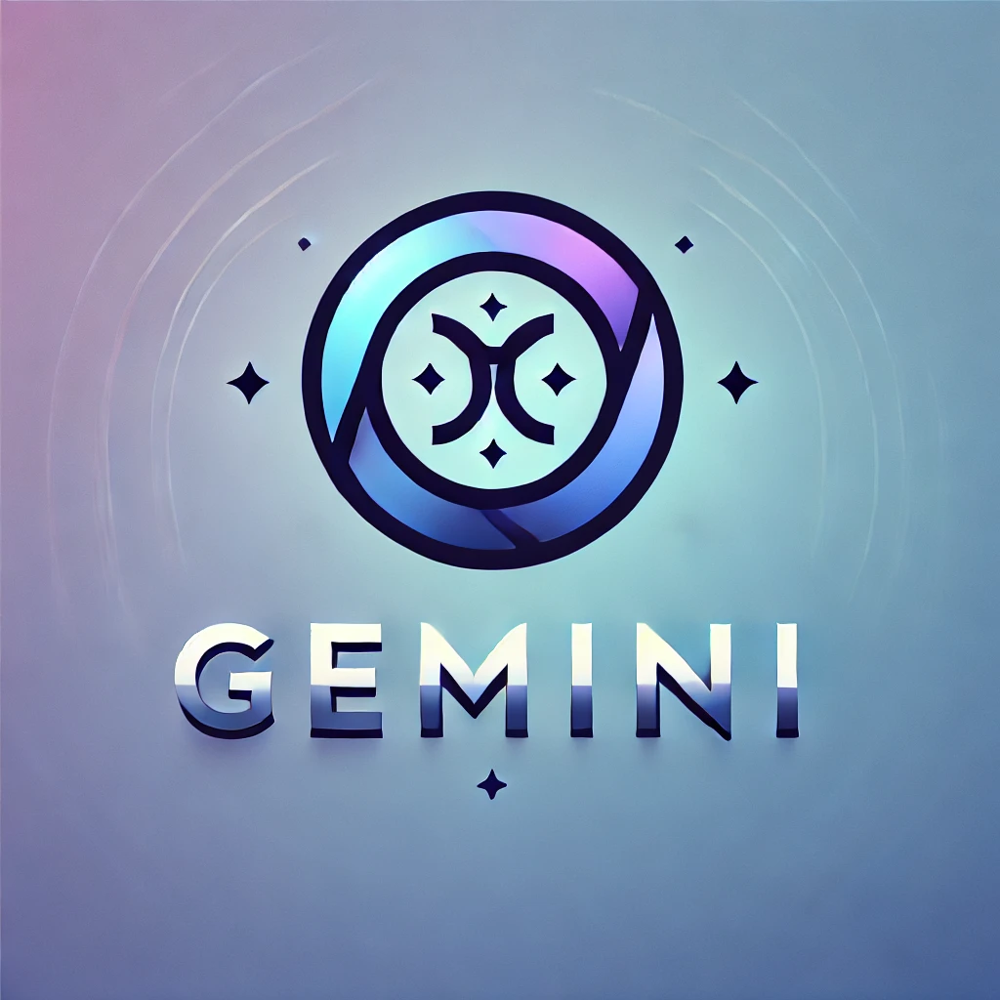

<p align="center">
  <a href="https://quill-on-nuxtjs.vercel.app/editor">
    
  </a>
</p>
<h1 align="center">
  Gemini text summarizer & people name extractor
</h1>

## 🖥 Context

Just wanted to try out Gemini API quickly.
Got my API key from Google AI Studio: https://aistudio.google.com/app/apikey.

## 📚 Libraries
- Ruby 3.3.3

## 👨🏻‍💻 Local development

1. Run the script like so.

```
> irb
> load("gemini.rb")
> Gemini.summarize("Tony is a man from France.")
=> "Tony is a French man. He originates from France, indicating his nationality or place of birth. This information simply states his national origin.\n"
> Gemini.extract_names("Tony Duong is a man from France.")
=> [{"first_name"=>"Tony", "last_name"=>"Duong"}]
```

### 💡 Key takeaway
- You can use structured output to make Gemini return a JSON object instead of a string by specifying the below options as a parameter.
```
generationConfig: {
  response_mime_type: "application/json",
  response_schema: {
    type: "ARRAY",
    items: {
      type: "OBJECT",
      properties: {
        first_name: { type: "STRING" },
        last_name: { type: "STRING" }
      }
    }
  }
}
```
